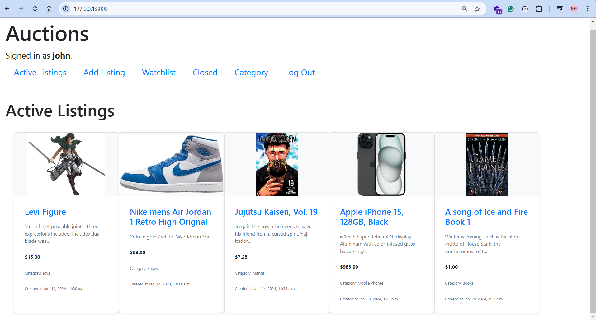

## Commerce - CS50w Project 2

This project is an online auction platform built with Django and SQLite3 that allows users to create, bid on, and manage auction listings.
Users can browse active listings, place bids, add items to a personal watchlist, and interact with other users through comments.
Listings can be categorized for better organization, and the highest bidder wins when an auction is closed.
The platform also includes an admin interface for managing listings, bids, and comments.

### Screenshots

### Features

-   Create Listing

    -   Users can create new auction listings by providing:

        -   Title & Description – Basic details about the item.
        -   Starting Bid – The minimum amount for the auction.
        -   Optional Image URL – A photo to showcase the item.
        -   Category Selection – Assign a category like Fashion, Toys, or Electronics.

-   Active Listings Page
    -   Displays all ongoing auctions with details like title, description, current price, and an image (if available).
    -   Acts as the homepage where users can browse auctions.
-   Listing Page

    -   Each listing has a dedicated page showing its full details.
    -   Bidding System:
        -   Signed-in users can place bids.
        -   Bids must be higher than the current highest bid.
    -   Watchlist Management:

        -   Users can add/remove listings from their personal Watchlist.

    -   Auction Closure:
        -   Listing creators can close the auction, declaring the highest bidder as the winner.
        -   Winners see a confirmation message when viewing the closed listing.
    -   Comment Section:
        -   Signed-in users can leave and view comments on listings.

-   Categories

    -   A dedicated page lists all available auction categories.
    -   Clicking on a category filters and displays all active listings in that category.

-   Django Admin Interface
    -   Site admin can view, add, edit, and delete:
        -   Listings
        -   Bids
        -   Comments
    -   Provides full backend control over the platform.

### Admin Interface Credentials

-   username: saw
-   password: saw_password
